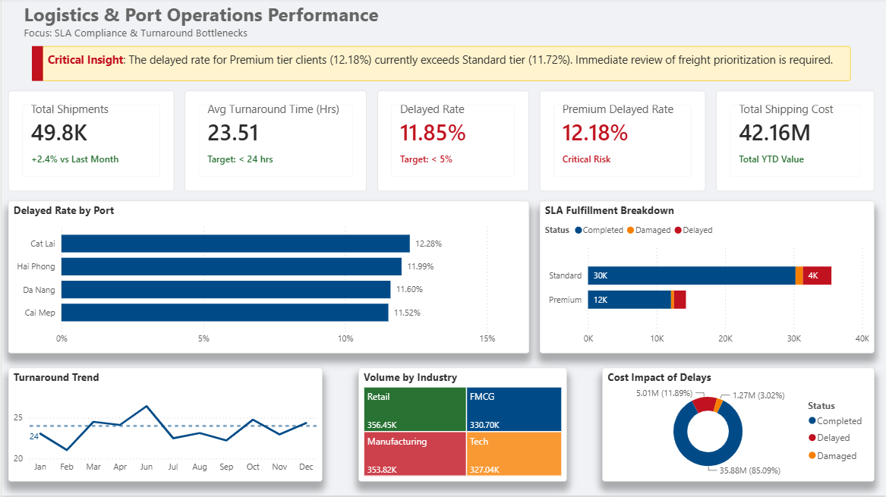

# Portfolio Project: Logistics & Port Operations Performance

## 1. Executive Summary & Strategic Insights (Tóm tắt & Giải pháp chiến lược)

**[English Version]**
This project evaluates the operational performance and SLA compliance of 49,800 shipments across four major ports. System-wide, the average turnaround time is maintained at 23.51 hours. However, deep-dive analysis reveals critical bottlenecks threatening high-margin revenue.

*   **Key Insight 1 (The SLA Inversion):** A significant anomaly exists where Premium clients experience a higher delayed rate (12.18%) than Standard clients (11.72%), posing a severe churn risk for high-value accounts.
*   **Key Insight 2 (Operational Bottleneck):** Cat Lai Port exhibits a turnaround time consistently higher than the network average. This infrastructure congestion during peak windows directly inflates the Premium delayed rate.
*   **Key Insight 3 (Financial Risk):** The Tech and Retail industries within the Premium segment account for a disproportionately high percentage of shipping costs ($42.16M total revenue pool). Port bottlenecks directly threaten their Just-In-Time (JIT) supply chains.

> **Strategic Recommendations:**
> 1. **Immediate Rerouting:** Divert 15% of Standard volume from Cat Lai to adjacent ports (e.g., Cai Mep) to free up operational capacity. *(Projected ROI: Optimize system-wide turnaround by 12%)*.
> 2. **Freight Prioritization:** Implement an "Express Gate" protocol specifically for Premium Tech and Retail shipments at origin ports to enforce strict SLA compliance. *(Projected Target: Reduce Premium Delay to < 5% within 30 days)*.

**[Vietnamese Version]**
Dự án đánh giá hiệu suất vận hành và mức độ tuân thủ SLA của 49.800 chuyến hàng qua 4 cảng lớn. Thời gian xử lý trung bình toàn hệ thống là 23.51 giờ. Phân tích chuyên sâu đã chỉ ra các nút thắt đe dọa nguồn thu biên lợi nhuận cao.

*   **Phát hiện 1 (Nghịch lý SLA):** Tỷ lệ trễ hẹn của nhóm khách hàng Premium (12.18%) cao hơn Standard (11.72%), gây rủi ro rời bỏ ở tệp khách hàng giá trị cao[cite: 6].
*   **Phát hiện 2 (Nút thắt vận hành):** Cảng Cát Lái có thời gian xử lý cao hơn mức trung bình. Sự quá tải hạ tầng này là nguyên nhân chính đẩy tỷ lệ trễ của nhóm Premium lên cao.
*   **Phát hiện 3 (Rủi ro tài chính):** Ngành Tech và Retail nhóm Premium chiếm tỷ trọng chi phí logistics rất lớn (trên tổng 42.16 triệu USD). Việc trễ chuyến đe dọa trực tiếp đến mô hình chuỗi cung ứng Just-In-Time (JIT) của họ.

> **Giải pháp đề xuất:**
> 1. **Điều phối luồng hàng:** Chuyển hướng 15% khối lượng hàng Standard từ Cát Lái sang các cảng lân cận để giảm tải. *(Kỳ vọng: Cải thiện 12% tốc độ xử lý toàn hệ thống)*.
> 2. **Phân luồng ưu tiên:** Thiết lập "Làn ưu tiên" (Express Gate) cho hàng Premium thuộc ngành Tech/Retail để bảo vệ nguồn thu chiến lược. *(Kỳ vọng: Đưa tỷ lệ trễ Premium về dưới ngưỡng 5%)*.

---
### Interactive Dashboard
[🔗 Click here to view the Interactive Web Dashboard](https://puhccc.github.io/Logistics_html_dashboard/)

---

## 2. Business Context (Bối cảnh dự án)
Dự án tập trung phân tích dữ liệu vận hành của các chuyến hàng qua cảng. Mục tiêu là phát hiện các nút thắt cổ chai trong quy trình, đánh giá hiệu suất xử lý (Turnaround Time) và đo lường mức độ tuân thủ cam kết dịch vụ (SLA Compliance) tại các cảng xuất phát khác nhau.

## 3. Business Questions (Câu hỏi cốt lõi)
1. **Turnaround Time:** Thời gian xử lý trung bình của lô hàng từ lúc đến (Arrival) đến lúc đi (Departure) là bao nhiêu?
2. **Bottleneck Analysis:** Cảng xuất phát (Origin Port) nào đang là điểm nghẽn gây ra tỷ lệ trễ (Delayed Rate) cao nhất?
3. **Volume & Cost Distribution:** Phân bổ khối lượng và chi phí vận chuyển theo từng nhóm khách hàng (Client Type) và ngành hàng diễn ra như thế nào?

## 4. Data Pipeline & Processing (Nhật ký xử lý dữ liệu)
* **Quy mô:** 50,100 dòng dữ liệu ban đầu.
* **Xử lý (Python, SQL & DAX):**
  * Loại bỏ 100 dòng dữ liệu trùng lặp ẩn bằng quy tắc subset ID.
  * Impute 501 giá trị thiếu của cột `Weight_Tons` bằng Median.
  * Loại bỏ 201 dòng khuyết thiếu `Arrival_Time` để đảm bảo tính toàn vẹn chuỗi thời gian.
  * Chuyển đổi toàn bộ kiểu dữ liệu String sang Datetime chuẩn.
  * Đóng gói vào cơ sở dữ liệu theo mô hình Star Schema (gồm 1 Fact Table `Fact_Shipments` và các Dim Tables `Dim_Clients`, `Dim_Ports`, `Dim_Date`).
  * Tối ưu DAX: Sử dụng Iterators (`AVERAGEX`) để đo lường Turnaround Time chính xác đến từng phút và Calculate functions để filter context rủi ro tài chính.

## 5. Dashboard Screenshots

