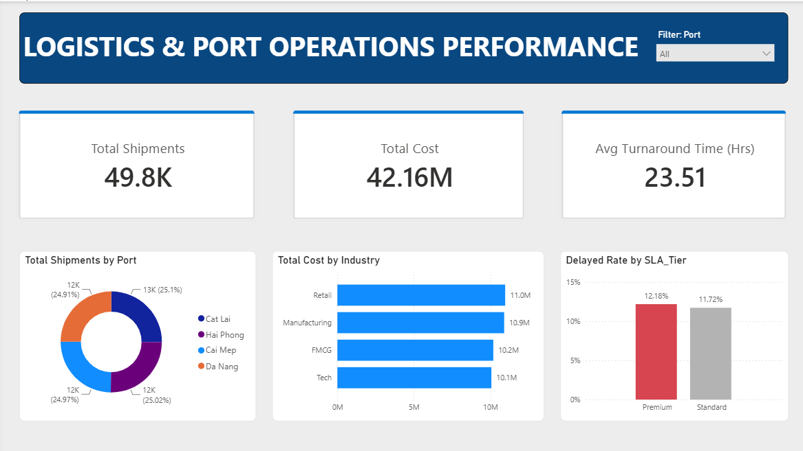

# Portfolio Project: Logistics & Port Operations Performance

## 1. Executive Summary (Tóm tắt quản trị)

**[English Version]**
This dashboard evaluates the operational performance and SLA compliance of 49,800 shipments across four major ports. System-wide, the average turnaround time is maintained at 23.51 hours.

> **Critical Insight:** A significant operational anomaly was identified within the SLA fulfillment process. The delayed rate for Premium tier clients (12.18%) currently exceeds that of Standard tier clients (11.72%). Immediate reassessment of freight prioritization protocols at origin ports is strongly recommended to mitigate churn risk among high-value clients.

**[Vietnamese Version]**
Báo cáo này đánh giá hiệu suất vận hành và mức độ tuân thủ SLA của 49.800 chuyến hàng qua 4 cảng lớn. Trên toàn hệ thống, thời gian xử lý trung bình được duy trì ở mức 23.51 giờ.

> **Phát hiện cốt lõi:** Một điểm bất thường nghiêm trọng trong vận hành đã được phát hiện trong quy trình thực thi SLA. Tỷ lệ trễ hẹn của nhóm khách hàng Premium (12.18%) hiện đang vượt quá mức của nhóm Standard (11.72%). Khuyến nghị cần đánh giá lại ngay lập tức các quy trình ưu tiên hàng hóa tại các cảng xuất phát nhằm giảm thiểu rủi ro rời bỏ của nhóm khách hàng giá trị cao.

---
### Final Dashboard

---

## 2. Giới thiệu dự án (Business Context)
Dự án tập trung phân tích dữ liệu vận hành của các chuyến hàng qua cảng. Mục tiêu là phát hiện các nút thắt cổ chai trong quy trình, đánh giá hiệu suất xử lý (Turnaround Time) và đo lường mức độ tuân thủ cam kết dịch vụ (SLA Compliance) tại các cảng xuất phát khác nhau.

## 3. Các câu hỏi kinh doanh cốt lõi (Business Questions)
1. **Turnaround Time:** Thời gian xử lý trung bình của một lô hàng từ khi đến (Arrival) đến khi đi (Departure) là bao nhiêu?
2. **Bottleneck Analysis:** Cảng xuất phát (Origin Port) nào đang có tỷ lệ hàng hóa bị trễ (Delayed) cao nhất?
3. **Volume Distribution:** Phân bổ khối lượng hàng hóa (Weight) theo từng nhóm khách hàng (Client Type) diễn ra như thế nào?

## 4. Nhật ký xử lý dữ liệu (Data Dictionary & Profiling)
* **Tổng số dòng dữ liệu ban đầu:** 50,100 dòng.
* **Vấn đề phát hiện & Xử lý (Python & SQL):**
  * Tồn tại 100 dòng dữ liệu trùng lặp ẩn (Đã xử lý bằng quy tắc subset ID).
  * Cột `Weight_Tons` thiếu 501 giá trị (Đã impute bằng Median).
  * Cột `Arrival_Time` thiếu 201 giá trị (Đã drop để đảm bảo tính toàn vẹn thời gian).
  * Chuyển đổi toàn bộ string sang định dạng `datetime` chuẩn.
  * Xây dựng luồng dữ liệu theo cấu trúc Star Schema để truy vấn.